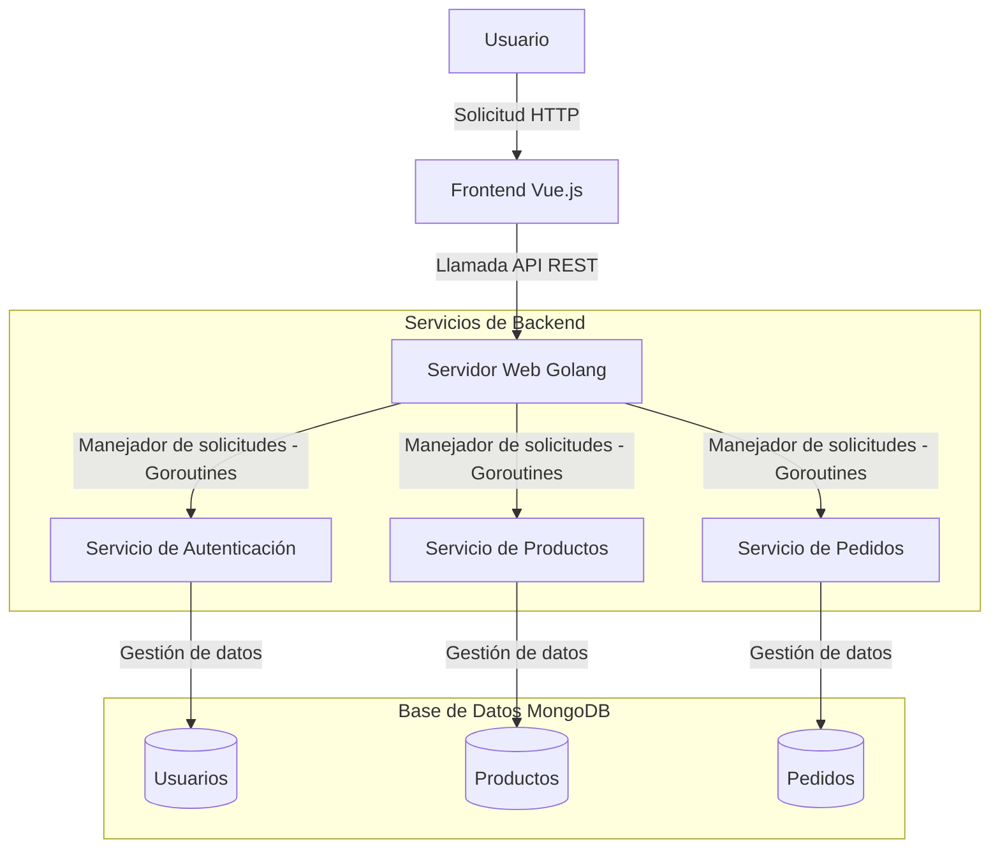
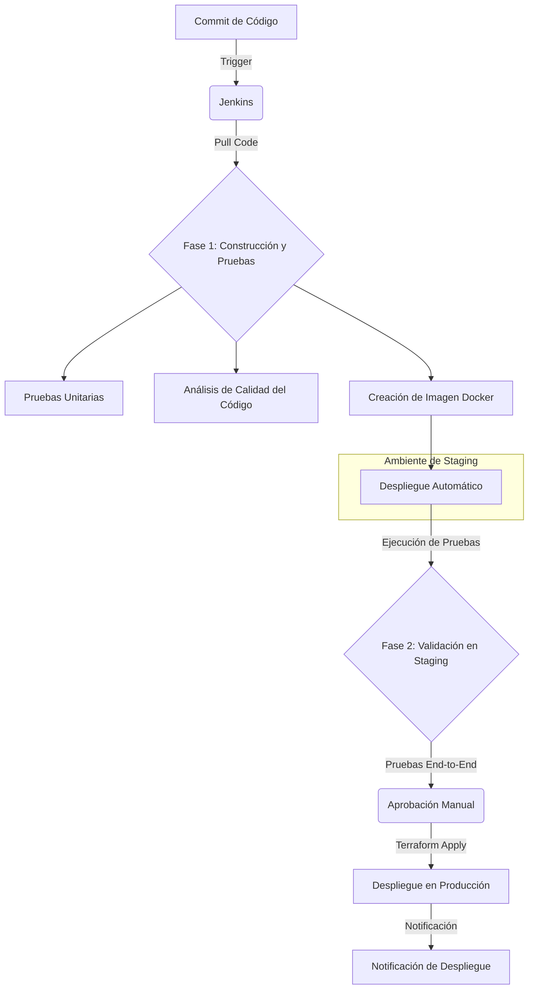
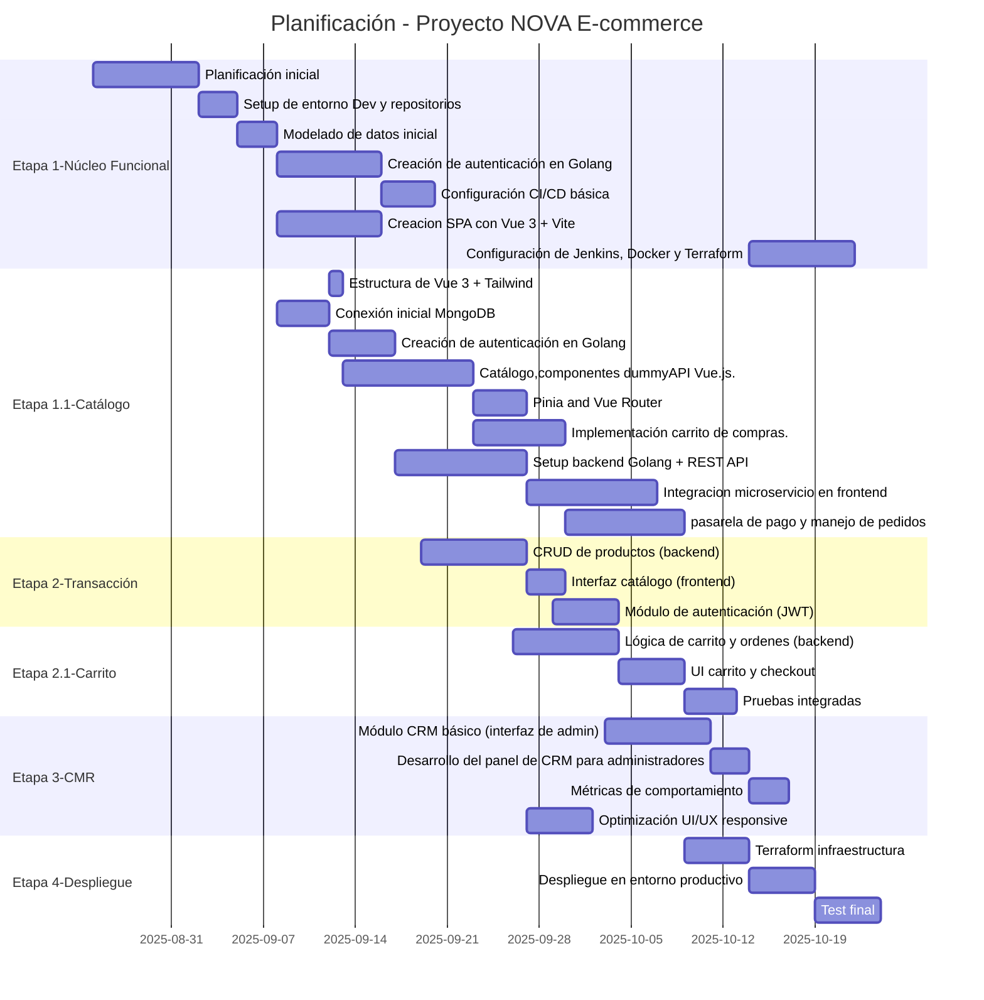

# NOVA E-COMMERCE

## Desarrollo de aplicativo web de comercio electrónico para la tienda virtual Nova, especializada en accesorios tipo joyería, bajo el modelo de negocio dropshipping

### Objetivo general

Desarrollar una aplicación web de comercio electrónico para la tienda virtual Nova, especializada en accesorios tipo joyería bajo el modelo de negocio dropshipping, que permita brindar una experiencia de usuario óptima, gestión personalizada de clientes y escalabilidad tecnológica.

### Objetivos específicos

1. Establecer una interfaz gráfica de usuario intuitiva y atractiva para facilitar la navegación del usuario.
2. Desarrollar un sistema de relacionamiento con el cliente (CRM) inicial, buscando el análisis del perfil y comportamiento de los clientes, implementando nuevas tecnologías
3. Implementar una aplicación web accesible, responsiva, intuitiva y atractiva para sus usuarios, cumpliendo con las buenas prácticas de accesibilidad web.

### Metodología y Arquitectura

El desarrollo web moderno combina metodologías ágiles con las prácticas de DevOps, que se centran en la entrega y operación del software. Las metodologías ágiles más populares son Scrum y Kanban. Mientras que Scrum se basa en una estructura fija con una duración de tiempo definida para cada sprint, Kanban se centra en un flujo de trabajo continuo.

| Característica | Scrum | Kanban |
|---|---|---|
| Cadencia | Sprints de duración fija ( 2 semanas) | Flujo continuo |
| Planificación | Planificación de Sprint (se define qué se hará en el sprint) | Planificación continua (el trabajo se prioriza en el Backlog) |
| Entrega | Al final de cada sprint | Tan pronto como una tarea está terminada |
| Adaptabilidad | Al final de un sprint (en la revisión) | En cualquier momento |

La búsqueda de la mejora continua con una mejor integración de los principios ágiles, publicados en su manifiesto en el año 2001, ha dado lugar a la filosofía DevOps, que promueve la colaboración, la entrega continua y la automatización, buscando acelerar el ciclo de vida del software y mejorar su calidad.

DevOps propone 24 capacidades clave en 5 categorías que serán fundamentales para la implementación de la mejora continua:

1.Capacidad de Entrega Continua:

- Automatización del despliegue.

- Integración Continua (CI).

- Gestión de la configuración.

2.Capacidad de Arquitectura:

- Arquitectura débilmente acoplada.

3.Capacidades de Producto y Proceso:

- Trabajar en lotes pequeños.

- Retroalimentación del cliente.

4.Colaboración.

5.Cultura.

La práctica de DevOps se centra en la automatización de la entrega de software, la colaboración y la integración de equipos. Esta práctica complementa a las metodologías ágiles actuales.

#### Metodología Kanban + DevOps

Este proyecto utiliza una metodología que combina la estructura de fases para hitos del proyecto con la flexibilidad y el flujo continuo de Kanban, y la implementación de la mejora continua de la filosofía DevOps. Esto permite la entrega de funcionalidades de manera fluida y constante.

**Fase 1**: Configuración y Núcleo Funcional:

Establecer el entorno de trabajo y entregar las funcionalidades básicas del usuario (registro y login).

- [x] Creacion SPA con vue.js con cada conponente diseno de funcionalidades basicas.

- [ ] Desarrollo del componente de login y registro en Vue.js.

- [ ] Desarrollo del componente carrito de compra en Vue.js.

- [ ] Creación de autenticación en Golang.

- [x] Modelado de datos inicial para la base de datos de MongoDB.

- [ ] Configuración de Jenkins, Docker y Terraform.

**Fase 2**: Catálogo y Transacción

Implementar la experiencia de compra, desde la visualización del producto hasta el pago.

- [ ] Creación del microservicio de productos en Golang.

- [ ] Diseño de la interfaz del catálogo y la página de detalles de producto en Vue.js.

- [ ] Implementación de la funcionalidad del carrito de compras.

- [ ] Integración de una pasarela de pago y manejo de pedidos.

**Fase 3**: CRM y Optimización
Agregar las funcionalidades de gestión del cliente y pulir el producto minimo viable (MVP) para el lanzamiento.

- [ ] Desarrollo del panel de CRM para administradores en Golang y Vue.js.

- [ ] Implementación de las prácticas de accesibilidad web.

- [ ] Pruebas de rendimiento y de seguridad.

- [ ] Configuración del monitoreo y la telemetría del sistema.

#### Flujo de trabajo

Los tableros Kanban son la mejor forma de visualizar el flujo de trabajo continuo de cada tarea. Esto ayuda a agrupar y priorizar las tareas para lograr el cumplimiento exitoso de los objetivos.

```mermaid
graph TD
    subgraph "Fase 1: Configuración y Núcleo Funcional"
        A[Backlog Priorizado] --> B(En Desarrollo);
        B --> C(En Pruebas);
        C --> D{Listo para Despliegue};
        D --> E[Desplegado en Producción];
    end
    subgraph "Fase 2: Catálogo y Transacción"
        F[Backlog Priorizado] --> G(En Desarrollo);
        G --> H(En Pruebas);
        H --> I{Listo para Despliegue};
        I --> J[Desplegado en Producción];
    end
    subgraph "Fase 3: CRM y Optimización"
        K[Backlog Priorizado] --> L(En Desarrollo);
        L --> M(En Pruebas);
        M --> N{Listo para Despliegue};
        N --> O[Desplegado en Producción];
    end
    linkStyle 0,1,2,3 stroke:#666,stroke-width:2px;
    linkStyle 4,5,6,7 stroke:#666,stroke-width:2px;
    linkStyle 8,9,10,11 stroke:#666,stroke-width:2px;
    classDef fase fill:#e6f3ff,stroke:#007bff,stroke-width:2px;
    class A,F,K fase;
```

#### Arquitectura Nova E-commerce

Las aplicaciones web actuales exigen concurrencia en sus operaciones, por lo que es indispensable el manejo de múltiples solicitudes concurrentes. Este factor y la necesidad de tener una arquitectura débilmente acoplada en la comunicación entre el frontend y el backend han llevado a la implementación de una arquitectura de microservicios.

A diferencia de los hilos tradicionales, las Goroutines son hilos de ejecución ligeros gestionados por el propio runtime de Go, no por el sistema operativo. Esto permite que Go inicie miles o incluso millones de goroutines de manera eficiente, lo que es clave para tu proyecto. Cuando un usuario hace una solicitud para ver un producto, el servidor de Golang inicia una Goroutine para manejar esa petición. Si simultáneamente 1,000 usuarios más hacen solicitudes, Golang puede iniciar 1,000 goroutines más casi al instante. Esto permite que el backend gestione todas las solicitudes concurrentemente, sin bloquearse, lo que resulta en un rendimiento superior y una respuesta rápida, incluso con un alto volumen de tráfico.

#### Pipeline de Entrega Continua (CI/CD)

El pipeline de DevOps automatiza todo el proceso de entrega de software, garantizando que el código pase de tu repositorio a producción de manera segura y eficiente.

#### Stack de Tecnologias y su Rol en la Metodología

- **Vue 3 + Vite** (Frontend): permite un desarrollo frontend rápido y reactivo, crucial para una experiencia de usuario óptima.
-**Golang**(Backend): Ideal para un backend escalable y de alto rendimiento. Su compilación a un único binario facilita la creación de imágenes de Docker ligeras y eficientes.
- **MongoDB**: Una base de datos flexible que se adapta bien al modelo de e-commerce, permitiendo una rápida iteración sobre la estructura de los datos de productos y pedidos.
- **Docker**: Permite empaquetar tu aplicación y sus dependencias en un contenedor aislado.
- **Terraform**: Automatiza la gestión de tu infraestructura como código (Iac). Cumpliendo con buenas practicas de accesibilidad web/nube.
- **Jenkins**: El motor de automatización. Orquesta todo el pipeline, desde la detección de cambios en el código hasta el despliegue final en producción.

#### Diagrama de Gantt

